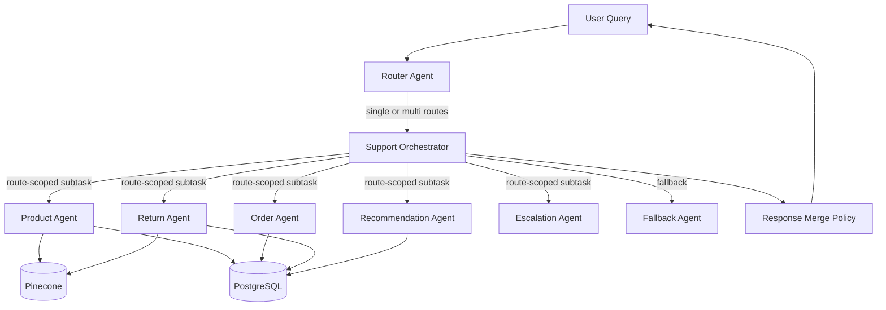

# Core Workflow Handover (POC)

## 1. Scope and Current Status

This document summarizes what is implemented for the core customer-support workflow.

Current status:
- Core router -> orchestrator -> specialist-agent flow is implemented.
- Multi-intent routing with sequential execution is implemented.
- Deterministic fallback mode is implemented for environments without LLM credentials.
- Pinecone retrieval and indexing pipeline is implemented for policies and reviews.
- Core readiness, indexing, and smoke-test scripts are available.

## 2. What Is Implemented (Agent-wise)

### 2.1 Product Agent
Path: src/agents/product_agent/

Implemented:
- SQL-based product facts lookup through product_catalog.
- Semantic review retrieval support through search_product_reviews.
- Guardrail checks on user input and output.

Key files:
- src/agents/product_agent/agent.py
- src/agents/product_agent/prompts.py
- src/agents/product_agent/tools.py

### 2.2 Order Agent
Path: src/agents/order_agent/

Implemented:
- Place order into orders and order_items tables.
- Get order status, track shipment, list customer orders, cancel order.
- Input hardening for order_id format, address validation, max item count, quantity parsing.
- Duplicate line-item consolidation before write.

Key files:
- src/agents/order_agent/agent.py
- src/agents/order_agent/tools.py

### 2.3 Return Agent
Path: src/agents/return_agent/

Implemented:
- Return policy lookup with Pinecone-first retrieval and local markdown fallback.
- Return eligibility check using order and order_item data.
- Create return request in returns table.
- Return status lookup.
- Duplicate active-return prevention for same order item.

Key files:
- src/agents/return_agent/agent.py
- src/agents/return_agent/tools.py

### 2.4 Recommendation Agent
Path: src/agents/recommendation_agent/

Implemented:
- Profile-aware recommendation flow.
- Uses customer profile, order history, and product catalog ranking.
- Budget-aware filtering and relevance by historical categories.

Key files:
- src/agents/recommendation_agent/agent.py
- src/agents/recommendation_agent/tools.py

### 2.5 Escalation Agent
Path: src/agents/escalation_agent/

Implemented:
- Risk assessment for escalation triggers.
- Human handoff summary tool output.

Key files:
- src/agents/escalation_agent/agent.py
- src/agents/escalation_agent/tools.py

### 2.6 Fallback Agent
Path: src/agents/fallback_agent/

Implemented:
- Standardized out-of-scope response path.

Key files:
- src/agents/fallback_agent/agent.py

### 2.7 Router and Orchestrator
Paths:
- src/agents/router/
- src/agents/orchestrator/

Implemented:
- Intent routing for single and multi-intent queries.
- Route-scoped subtask decomposition per routed intent.
- Sequential execution through router policy only (no agent-to-agent calls).
- Confidence-aware escalation for low-confidence specialist routes.
- Deterministic response merge policy for multi-intent outputs.

Key files:
- src/agents/router/agent.py
- src/agents/orchestrator/agent.py

## 3. Minimal Architecture / Interaction Diagram

## 4. Retrieval Layer (Pinecone + Sentence Transformers)

Implemented:
- Embedding wrapper using sentence-transformers.
- Pinecone vector store wrapper (index creation, upsert, query).
- Retriever service for policies and reviews.
- Indexing pipeline to ingest policy markdown files and review text chunks.

Key files:
- src/embeddings/embedder.py
- src/embeddings/vector_store.py
- src/rag/retriever.py
- src/rag/pipeline.py
- pipelines/03_build_vector_indexes.py

## 5. Guardrails and Hardening Implemented

### 5.1 Guardrails
Implemented in shared and agent-specific layers:
- Input guardrails:
  - Empty input rejection
  - Maximum input length
  - Prompt-injection pattern blocking
- Output guardrails:
  - Empty output fallback
- SQL guardrails:
  - Read-only SQL enforcement for query-only tools
  - Write operations blocked in read paths

Key file:
- src/agents/common.py

### 5.2 Hardening Measures
Implemented:
- Parameterized SQL execution helpers for safer DB operations.
- Controlled write operations for order/return creation.
- Order input validation (formats, limits, address, quantity).
- Duplicate return request prevention for active return cases.
- Low-confidence route escalation.
- Deterministic fallback mode when LLM path is unavailable.

Key files:
- src/data/postgresql.py
- src/agents/order_agent/tools.py
- src/agents/return_agent/tools.py
- src/agents/orchestrator/agent.py
- src/agents/deterministic_agent.py

## 6. Deterministic Fallback Mode (Core POC Reliability)

Implemented:
- Router gracefully downgrades to keyword routing if LLM init fails.
- Orchestrator can run in deterministic mode by flag or automatic fallback.
- This allows core smoke validation even without GROQ key.

Relevant settings:
- Environment switch: SUPPORT_DETERMINISTIC_MODE=true

Key files:
- src/agents/router/agent.py
- src/agents/orchestrator/agent.py
- src/agents/deterministic_agent.py

## 7. What You Need To Do From Your Side

1. Environment setup
- Ensure Python environment has project dependencies installed.
- Verify .env has PostgreSQL settings and password.

2. Optional but recommended for full quality
- Add GROQ_API_KEY for LLM-backed responses.
- Add PINECONE_API_KEY and PINECONE_INDEX_NAME for vector retrieval.

3. Data availability
- Ensure required policy files exist under data/knowledge_base.
- Ensure required tables exist in PostgreSQL:
  - customers
  - orders
  - order_items
  - returns
  - product_catalog
  - reviews

4. Decide test mode
- For deterministic core test (no LLM key): set SUPPORT_DETERMINISTIC_MODE=true
- For full mode: set SUPPORT_DETERMINISTIC_MODE=false and provide keys

## 8. End-to-End Workflow Steps

### Recommended one-command core flow

Run:
- python pipelines/06_run_core_poc.py

This executes:
1. pipelines/05_core_readiness_check.py
2. pipelines/03_build_vector_indexes.py
3. pipelines/04_core_smoke_test.py

### Manual step-by-step flow

1. Readiness checks
- python pipelines/05_core_readiness_check.py

2. Build vector indexes
- python pipelines/03_build_vector_indexes.py --review-limit 5000

3. Smoke test
- python pipelines/04_core_smoke_test.py

4. Local CLI
- python main.py

5. Gradio UI
- python app/gradio_app.py

## 9. Core Test Coverage Added

Implemented tests include:
- Router keyword routing
- Router multi-intent detection
- Orchestrator route dispatch and fallback
- Low-confidence escalation behavior
- Multi-intent sequential execution
- Route-scoped subtask message propagation
- Deterministic-mode orchestration behavior

Key file:
- tests/test_agents.py

## 10. Notes for POC Scope

In-scope and complete for POC:
- Core routing, specialist handling, retrieval plumbing, and fallback reliability.

Deferred for later improvements:
- Advanced response quality tuning
- Full production observability
- Additional metrics and judge-based evaluation expansion
