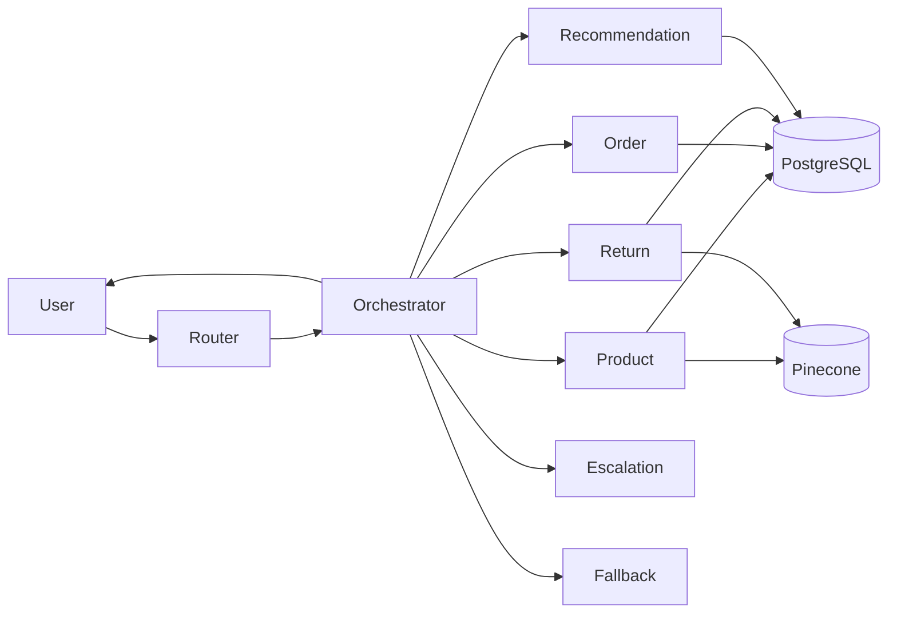

# Core Workflow Quick Start (POC)

## What Is Ready

- Router-driven multi-agent workflow is implemented.
- Specialist agents are implemented: Product, Order, Return, Recommendation, Escalation, Fallback.
- Retrieval stack is implemented: Sentence Transformers + Pinecone (policies + reviews).
- Deterministic fallback mode is implemented (works without LLM key).

## Minimal Flow



## Required Setup

1. Install project dependencies in your environment.
2. Configure .env values:
- POSTGRESQL_HOST
- POSTGRESQL_PORT
- POSTGRESQL_USER
- POSTGRESQL_DB
- POSTGRESQL_AIVEN_PASSWORD

3. Optional keys:
- GROQ_API_KEY (for full LLM mode)
- PINECONE_API_KEY
- PINECONE_INDEX_NAME

4. Optional deterministic mode:
- SUPPORT_DETERMINISTIC_MODE=true

## End-to-End Run (Recommended)

Run one command:

```bash
python pipelines/06_run_core_poc.py
```

This executes:
1. Readiness check
2. Vector index build
3. Smoke test

## Manual Run Steps

```bash
python pipelines/05_core_readiness_check.py
python pipelines/03_build_vector_indexes.py --review-limit 5000
python pipelines/04_core_smoke_test.py
python main.py
python app/gradio_app.py
```

## Key Hardening Included

- Input/output guardrails for agent interactions.
- SQL safety guardrails for read-only tools.
- Controlled write paths for order/return creation.
- Duplicate return request prevention.
- Confidence-aware escalation from orchestrator.
- Deterministic fallback if LLM path is unavailable.

## If Something Fails

1. Run readiness script first.
2. Verify PostgreSQL table presence: customers, orders, order_items, returns, product_catalog, reviews.
3. Rebuild vector indexes.
4. Enable deterministic mode for core-path validation without LLM credentials.

## Detailed Document

For full implementation details, refer to:
- docs/core_workflow_handover.md
