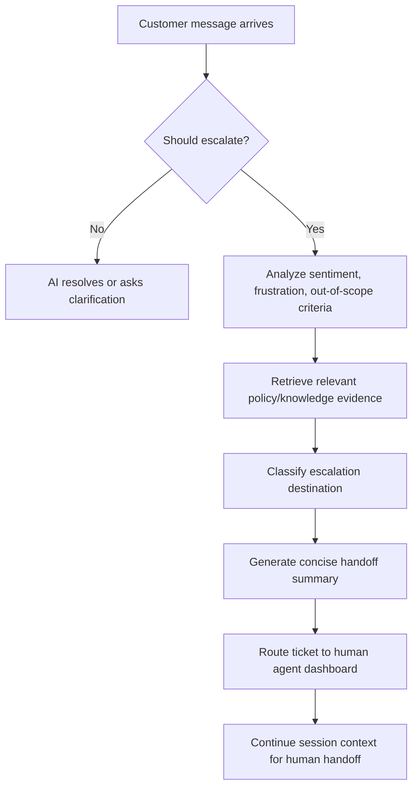

# Escalation Agent

## Purpose
The Escalation Agent is a specialized support layer that monitors customer conversations for high-risk or out-of-scope issues, then prepares a concise handoff to a human agent.

## Core Responsibilities
- **Sentiment and complexity monitoring**: detect extreme frustration, profanity, repeated requests, and issues that exceed the primary AI agents' capabilities.
- **Contextual handoff summarization**: create a short, clear ticket summary for the human agent.
- **Pipeline routing**: classify escalated issues into the proper department: Billing, Technical Support, or Management.
- **Maintaining continuity**: preserve session context so customers do not need to repeat their issue when a human takes over.
- **RAG-aware support**: optionally incorporate relevant policy or knowledge-base evidence when deciding whether escalation is needed.

## Implementation
The escalation agent is implemented in `src/agents/escalation_agent` and includes:

- `agent.py` — `EscalationAgent` class that creates a LangGraph ReAct agent with conversation memory.
- `config.py` — runtime and RAG-related constants.
- `prompts.py` — system prompt templates and handoff summary renderers.
- `tools.py` — escalation-specific tools such as knowledge retrieval and department classification.

## Behavior and flow
1. A new message arrives from the customer.
2. The Escalation Agent evaluates whether the request is in-scope for AI support.
3. If escalation is required, it generates:
   - original customer intent
   - prior actions taken by AI agents
   - customer pain points and tone
   - relevant retrieval evidence or policy guidance
   - destination department and reason for escalation
4. If escalation is not required, it returns an AI resolution or clarification prompt.

## Handoff Summary Requirements
When a handoff is created, the summary should include:
- **Original customer intent**
- **Steps already taken**
- **Identified pain points**
- **Relevant RAG or policy evidence**
- **Recommended escalation destination**
- **Reason for escalation**

## Escalation Routing Logic
- **Billing**: refunds, charges, billing disputes, payment issues.
- **Technical Support**: product malfunctions, login/connectivity/error issues, inaccessible services.
- **Management**: complaints, policy exceptions, requests for a manager, severe dissatisfaction.
- **General Support**: all other unresolved questions that still require human review.

## Integration Notes
- Use `EscalationAgent.chat(user_message)` to evaluate each incoming message.
- Call `EscalationAgent.reset_memory()` when the session ends or when a clean slate is needed.
- The `retrieve_knowledge` tool is currently a placeholder and should be connected to the repository's RAG retriever if available.

## Connecting the Escalation Agent with Other Agents
The escalation agent is best treated as a safety and handoff layer rather than as a primary business agent. In practice, it should sit after the main agents such as the product, order, or recommendation agents.

### Recommended integration pattern
1. A customer message enters the system.
2. A specialist agent (for example, product or order) tries to resolve the request.
3. The orchestrator or router passes the original message plus the specialist agent's response to the escalation agent.
4. The escalation agent decides whether the issue should stay in AI flow or be handed off to a human team.

### Why this pattern works
- It keeps the escalation logic centralized in one place.
- It avoids duplicate escalation rules across multiple agents.
- It preserves context for the human agent because the escalation summary includes the customer intent, prior actions, and pain points.

### Simple flow
```text
Customer message
    -> Product / Order / Recommendation agent
    -> Router / Orchestrator
    -> Escalation Agent
    -> Either: continue AI resolution or create a human handoff summary
```

### Example: product agent + escalation agent
```python
from src.agents.escalation_agent import EscalationAgent
from src.agents.product_agent import ProductRecommendationAgent

product_agent = ProductRecommendationAgent(session_id="session_123")
escalation_agent = EscalationAgent(session_id="session_123")

customer_message = (
    "I bought a laptop last week, but it is not working and I want a refund."
)

product_reply = product_agent.chat(customer_message)

combined_context = (
    f"Customer message: {customer_message}\n"
    f"Product agent response: {product_reply}"
)

result = escalation_agent.chat(combined_context)
print(result)
```

### How this would work in practice
- If the product agent solves the issue, the escalation agent may return a short confirmation or no escalation.
- If the customer is angry, asks for a refund, mentions policy exceptions, or the product agent cannot resolve the issue, the escalation agent will classify the request and produce a handoff summary.
- The handoff can then be forwarded to a support queue, ticket system, or human support dashboard.

## Example Usage
```python
from src.agents.escalation_agent import EscalationAgent

agent = EscalationAgent(session_id="session_123")
response = agent.chat(
    "I want a refund and I have been waiting for 3 weeks. This is unacceptable."
)
print(response)
```

## Flowchart


## Future Work
- Connect `retrieve_knowledge` to an actual RAG retriever.
- Add explicit escalation scoring and threshold handling.
- Extend departmental routing rules with more fine-grained categories.
- Add automated tests that verify escalation summaries and routing logic.
